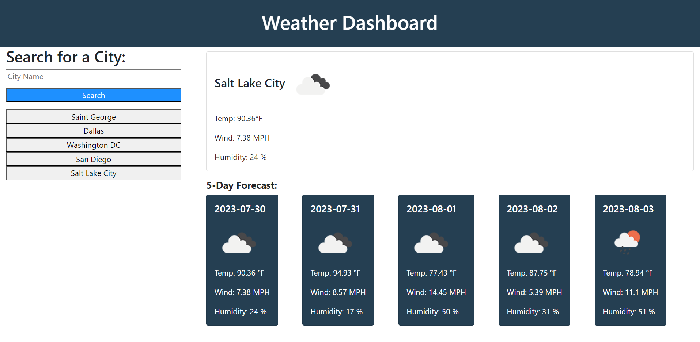

# 06-Weather-Dashboard

  ## Description
  This project is a weather dashboard that allows users to search for current weather and 5-day forecast information by city.

  ## Table of Contents
  1. [Usage](#usage)
  6. [Info](#info)

  ## Usage
  Type any city's name into the search bar and click search, or click one of the history buttons to search for a previously searched city.

  ## Info
  [Project Repository](https://github.com/Emill0004/06-Weather-Dashboard)

  [Deployed Website](https://emill0004.github.io/06-Weather-Dashboard/)

  